# $\mathcal{AI}$ **Software Architect Platform** GİZLİ
### *Kapsamlı Ürün & Yazılım Dokümantasyonu*

---

> **Versiyon:** 1.0 &nbsp;|&nbsp; **Durum:** Draft &nbsp;|&nbsp; **Dil:** TR / EN Mixed

---

## İçindekiler

1. [Doküman Amacı](#1-doküman-amacı)
2. [Ürün Adı](#2-ürün-adı-placeholder)
3. [Executive Summary](#3-executive-summary)
4. [Vision Statement](#4-vision-statement)
5. [Core Value Proposition](#5-core-value-proposition)
6. [Problem Statement](#6-problem-statement)
7. [Target Users](#7-target-users)
8. [User Personas](#8-user-personas)
9. [Use Cases](#9-use-cases)
10. [Product Positioning](#10-product-positioning)
11. [Product Philosophy](#11-product-philosophy)
12. [Supported System Patterns](#12-supported-system-patterns)
13. [Functional Overview](#13-functional-overview)
14. [Onboarding Flow](#14-onboarding-flow)
15. [Dashboard Structure](#15-dashboard-structure)
16. [Project Creation Flow](#16-project-creation-flow)
17. [Core Outputs](#17-core-outputs)
18. [Interactive Editing Experience](#18-interactive-editing-experience)
19. [AI System Design](#19-ai-system-design)
20. [Architecture Decision Logic](#20-architecture-decision-logic)
21. [Internal Data Models](#21-suggested-internal-data-models)
22. [System Architecture (Platform)](#22-system-architecture-platform-itself)
23. [Technical Stack](#23-suggested-technical-stack)
24. [Pricing Intelligence Layer](#24-pricing-intelligence-layer)
25. [Business Model](#25-business-model)
26. [MVP Definition](#26-mvp-definition)
27. [Development Constraints](#27-development-constraints)
28. [Technical Risks](#28-main-technical-risks)
29. [Risk Mitigation](#29-risk-mitigation-strategies)
30. [Non-Functional Requirements](#30-non-functional-requirements)
31. [UX Principles](#31-ux-principles)
32. [Example User Journey](#32-example-user-journey)
33. [Example Revision Prompts](#33-example-revision-prompts)
34. [Success Metrics](#34-success-metrics)
35. [Roadmap](#35-roadmap-suggestion)
36. [Long-Term Expansion](#36-long-term-expansion-ideas)
37. [What This Product Is Not](#37-what-this-product-is-not)
38. [Strategic Insight](#38-strategic-insight)
39. [Final Product Definition](#39-final-product-definition)
40. [Next Deliverables](#40-immediate-next-deliverables)
41. [Sonuç](#41-short-conclusion)

---

## 1. Doküman Amacı

Bu doküman, yapay zeka destekli bir **Virtual Software Architect Platform** fikrinin kapsamlı ürün, teknik ve stratejik tanımını içerir. Amaç; platformun neyi çözdüğünü, kime hizmet ettiğini, nasıl çalışacağını, hangi modüllerden oluşacağını, nasıl geliştirileceğini ve hangi aşamalarla pazara çıkarılabileceğini netleştirmektir.

Bu doküman sadece bir fikir özeti **değildir**. Aynı zamanda aşağıdaki başlıkları tek bir yerde toplar:

| Alan | Kapsam |
|------|--------|
| 📌 Ürün Vizyonu | Uzun vadeli hedef ve konumlandırma |
| 👥 Kullanıcı & Problem Analizi | Persona'lar, use case'ler |
| ⚙️ Fonksiyonel Gereksinimler | Özellikler, akışlar, çıktılar |
| 🏗️ Teknik Mimari | Platform mimarisi, stack, servisler |
| 🤖 AI Orchestration | Subsystem tasarımı, karar mantığı |
| 🚀 MVP Kapsamı | İlk sürüm sınırları ve başarı kriterleri |
| 💰 Gelir Modeli | Freemium, Pro, Team planları |
| ⚠️ Riskler | Teknik ve ürün riskleri, mitigasyon |
| 🗺️ Yol Haritası | Phase 0 → Phase 4 |
| 📊 Başarı Metrikleri | Ürün, kullanıcı ve iş metrikleri |

---

## 2. Ürün Adı Placeholder

$$\boxed{\textbf{AI Software Architect Platform}}$$

> Çalışma adı olarak kullanılmaktadır. Alternatif marka isimleri daha sonra ayrıca üretilebilir. Şimdilik bu dokümanda isimden çok ürünün özü önemlidir.

---

## 3. Executive Summary

Bu platform, yazılım projesine başlamadan önce kullanıcıyı yönlendiren, gereksinimleri analiz eden, doğru soruları soran, alternatif sistem mimarileri üreten, tech stack öneren, maliyet tahmini yapan, cloud ve database seçimlerini gerekçelendiren ve tüm bunları görsel, etkileşimli ve dokümante edilebilir çıktılara dönüştüren **AI tabanlı** bir ürün olacaktır.

### Temel Vaat

> *Kullanıcıya, bir **senior software architect / solution architect** gibi yol göstermek ve bir yazılım projesine teknik olarak daha doğru bir yerden başlamasını sağlamak.*

### Fark Yaratan Unsur

Bu ürünün asıl farkı, yalnızca sohbet eden genel amaçlı bir chatbot olmak **değildir**. Asıl farkı; kullanıcının ihtiyacını rastgele promptlara bırakmadan, **sistematik bir keşif süreci** ile gereksinimleri ortaya çıkarıp bunlardan mimari kararlar üretmesidir.

Bu nedenle ürünün merkezinde basit bir LLM entegrasyonu değil, bir $\textbf{Architecture Intelligence Engine}$ olacaktır.

---

## 4. Vision Statement

$$\textit{"Yazılım fikrine veya ürün geliştirme sürecine başlamadan önce,}$$
$$\textit{dünya çapında danışılan standart AI tabanlı software architect platformu olmak."}$$

Başka bir ifadeyle bu platform:

```
Teknik bilgisi olmayan girişimci
            ↕  (köprü)
       Junior Developer
            ↕
Startup Ekipleri / Freelancer'lar / Teknik Organizasyonlar
```

...için **dijital karar merkezi** olacaktır.

---

## 5. Core Value Proposition

Platformun kullanıcılara sunduğu **6 temel değer:**

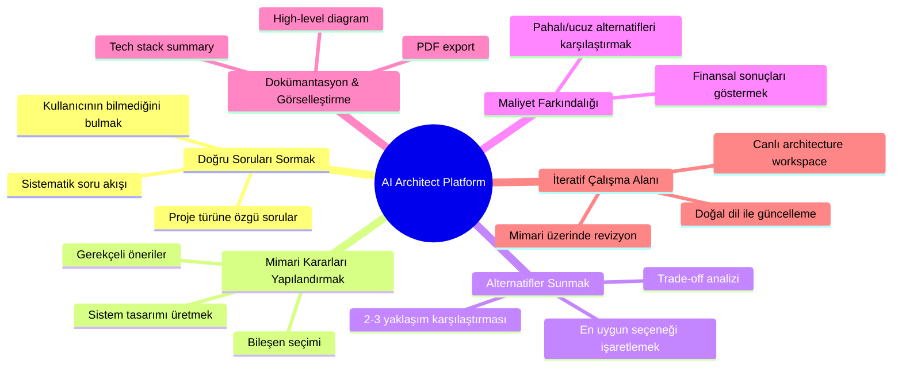

### Değer Özeti

| # | Değer | Açıklama |
|---|-------|----------|
| 1 | **Doğru soruları sormak** | Kullanıcı çoğu zaman neyi bilmediğini bilmez; platform bunu tespit eder |
| 2 | **Mimari kararları yapılandırmak** | Sadece öneri değil, gerçek sistem tasarımı üretir |
| 3 | **Alternatifler sunmak** | 2–3 yaklaşım + trade-off analizi |
| 4 | **Maliyet farkındalığı** | Teknik kararların finansal boyutunu gösterir |
| 5 | **Dokümantasyon & görselleştirme** | Diagram, tech stack, roadmap, PDF export |
| 6 | **İteratif workspace** | Statik rapor değil, yaşayan çalışma alanı |

---

## 6. Problem Statement

Yazılım projeleri çoğu zaman **kötü başlamaktadır.** Başlıca nedenler:

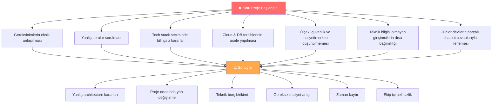

### Mevcut Çözümlerin Sorunu

> Bugün birçok kullanıcı ChatGPT, Claude veya benzeri araçlara danışmaktadır. Ancak mevcut yaklaşımın temel problemi şudur:
>
> *Sorular genelde kullanıcı tarafından **yanlış veya eksik** sorulur; dolayısıyla alınan mimari öneriler de eksik, uyumsuz veya yüzeysel olabilir.*

Bu ürün, tam olarak **bu boşluğu doldurmayı** hedefler.

---

## 7. Target Users

### 7.1 Primary Users

#### $\alpha$ — Non-technical Entrepreneur

Bu kullanıcı tipi bir girişim fikrine sahiptir ancak teknik mimari, cloud, backend, database veya software architecture konusunda uzman **değildir.**

| Örnek İhtiyaç | Platform Cevabı |
|--------------|----------------|
| "Bu ürünü nasıl kurmalıyım?" | Sistematik requirement toplama + architecture öneri |
| "Ne kadar maliyet çıkar?" | Tahmini maliyet breakdown |
| "Mobil mi web mi?" | Kullanım senaryosuna göre gerekçeli öneri |
| "Hangi veritabanı uygun?" | DB comparison + trade-off analizi |
| "MVP için neler gerekli?" | Önceliklendirilmiş feature listesi |

#### $\beta$ — Junior Developer

Bu kullanıcı bir ürün veya proje geliştirmek ister ancak **system design** ve architecture kararlarında yeterince deneyimli değildir.

| Örnek İhtiyaç | Platform Cevabı |
|--------------|----------------|
| "Monolith mi microservice mi?" | Scale + ekip büyüklüğüne göre öneri |
| "Firebase kullanmalı mıyım?" | Avantaj/dezavantaj + maliyet karşılaştırması |
| "SaaS için hangi stack mantıklı?" | Proven SaaS patterns |
| "Cache gerekiyor mu?" | Trafik beklentisine göre karar |
| "Scale olursa ne değişir?" | Scalability trade-off analizi |

### 7.2 Secondary Users

Zamanla platform şunlara da hizmet edebilir:

- 🧑‍💻 Freelance developers
- 🏢 Agency ekipleri
- 🚀 Startup technical teams
- 📋 Product managers
- 🤝 Technical co-founders
- 🎓 System design öğrenen öğrenciler

---

## 8. User Personas

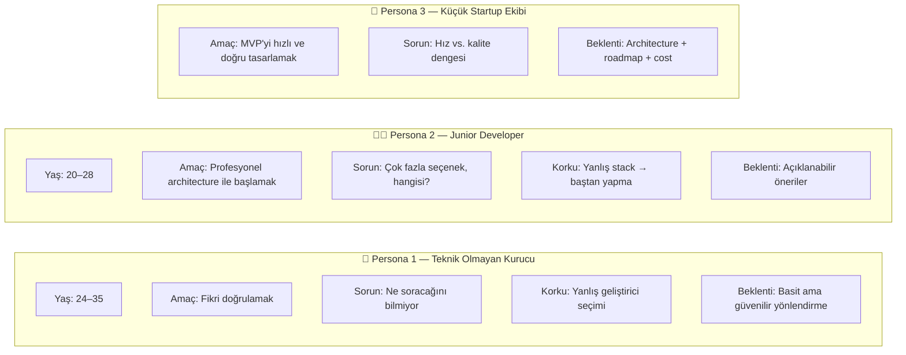

---

## 9. Use Cases

### Use Case 1 — $\text{Marketplace Startup}$

**Senaryo:** Kullanıcı *"araç kiralama marketplace'i"* yapmak istediğini söyler.

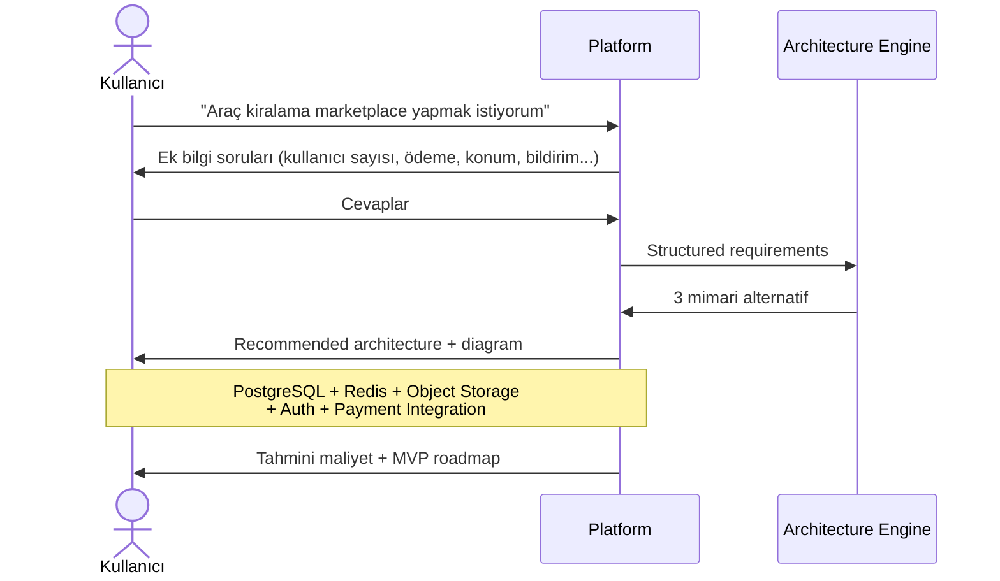

### Use Case 2 — $\text{AI Chatbot Product}$

**Senaryo:** Kullanıcı bir AI customer support chatbot ürünü yapmak ister.

Platform şu mimari bileşenleri tasarlar:

| Bileşen | Karar Alanı |
|---------|------------|
| LLM Provider | OpenAI / Anthropic / yerel model |
| Vector Database | Pinecone / Weaviate / pgvector |
| File Ingestion | PDF, DOCX, web scraping pipeline |
| Chat Session Storage | Redis + PostgreSQL |
| Rate Limiting | Per-user token limits |
| Analytics | Conversation quality tracking |
| Human Handoff | Eskalasyon kuralları |

### Use Case 3 — $\text{SaaS Multi-tenant App}$

Platform şu konularda mimari tasarım yapar:
- Tenant isolation modeli *(schema-per-tenant vs. row-level security)*
- Auth stratejisi *(JWT + RBAC)*
- Subscription billing *(Stripe integration)*
- Admin panel mimarisi
- Audit logging

### Use Case 4 — $\text{E-commerce Platform}$

Platform şu bileşen haritasını çıkarır:

```
inventory → cart → payment → order → shipment
    ↓           ↓        ↓         ↓
  stock      session  gateway   tracking
  mgmt       store    (Stripe)  webhook
                                   ↓
             admin ← notification ← search
             panel     service   (Elastic)
                          ↓
                       caching (Redis)
```

---

## 10. Product Positioning

$$\text{Bu ürün} \neq \text{General-purpose chatbot}$$
$$\text{Bu ürün} \neq \text{Diagram tool}$$
$$\text{Bu ürün} \neq \text{Cost calculator}$$
$$\text{Bu ürün} \neq \text{Documentation exporter}$$

$$\boxed{\text{Bu ürün} = \textbf{AI-powered Software Architect Workspace}}$$

> Bunların birleşiminden **daha büyük** bir şeydir.

---

## 11. Product Philosophy

Ürün geliştirme felsefesi **7 temel ilke** üzerine inşa edilmiştir:

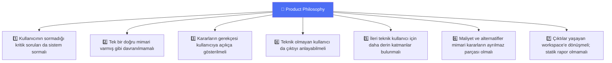

---

## 12. Supported System Patterns

İlk pattern library çekirdeği aşağıdaki **5 sistem türünü** kapsayacaktır:

| # | Pattern | Açıklama |
|---|---------|----------|
| 1 | **SaaS Multi-tenant Web Applications** | Schema isolation, subscription, RBAC |
| 2 | **Marketplace Systems** | Buyer/seller, payments, escrow, listings |
| 3 | **AI Chatbot Systems** | LLM, vector DB, RAG pipeline, human handoff |
| 4 | **Real-time Chat Systems** | WebSocket, presence, message persistence |
| 5 | **E-commerce Systems** | Cart, inventory, order management, search |

> Zamanla bu liste büyüyebilir: IoT platforms, fintech apps, social networks, analytics dashboards...

---

## 13. Functional Overview

Platformun temel akışı **16 adımda** özetlenebilir:

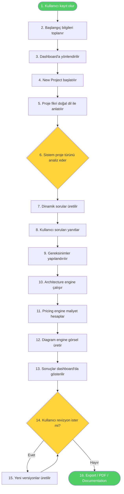

---

## 14. Onboarding Flow

### 14.1 Account Creation

Kullanıcı **e-posta** veya **sosyal giriş** ile kaydolur.

### 14.2 Sub-signup Soruları

Sistemin kullanıcıya daha uygun dil ve detay seviyesi sunabilmesi için başlangıç soruları sorulur:

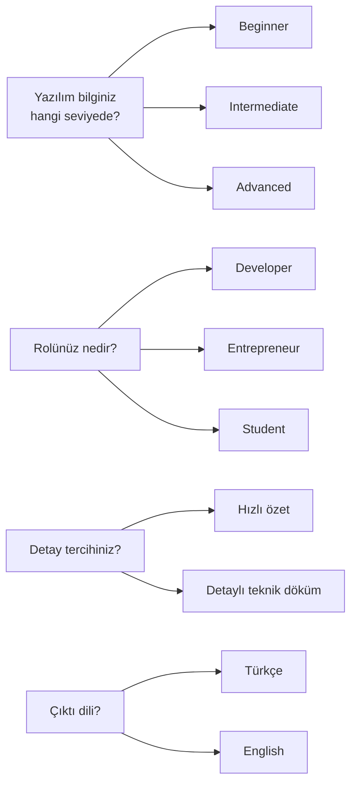

Bu bilgiler şu amaçlarla kullanılır:

- Açıklama tonunu ayarlamak
- Detay seviyesini belirlemek
- UI complexity göstergesini ayarlamak
- Chatbot yanıtlarını kişiselleştirmek

---

## 15. Dashboard Structure

İlk versiyon **web application** olarak çalışacaktır.

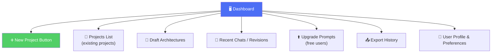

---

## 16. Project Creation Flow

### Step 1 — Initial Project Prompt

Kullanıcı projesini kısa veya detaylı bir şekilde anlatır:

```
"I want to build a multi-tenant SaaS invoicing platform for small businesses."
"I want to build a food delivery marketplace app."
"I want to create an AI chatbot for e-commerce customer support."
```

### Step 2 — Intent & Domain Detection

Sistem ilk açıklamayı analiz ederek çıkarımlar yapar:

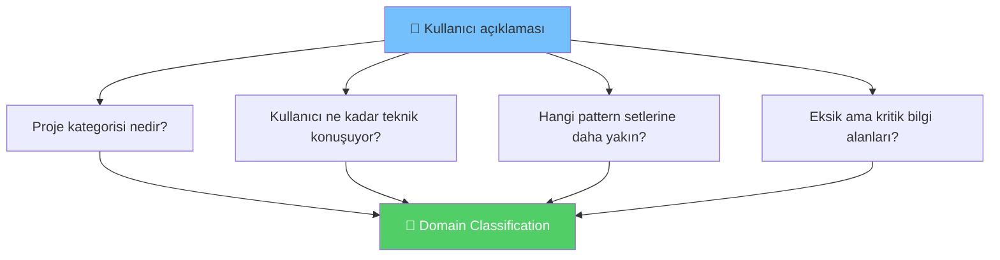

### Step 3 — Dynamic Question Generation

Sistem **10–15 civarında** yapılandırılmış soru sorar:

| Kategori | Örnek Sorular |
|----------|--------------|
| 📊 Scale | Hedef kullanıcı sayısı, günlük/aylık trafik beklentisi |
| ⚡ Real-time | Gerçek zamanlı özellik ihtiyacı var mı? |
| 📁 Medya | Dosya veya medya yükleme gerekiyor mu? |
| 💳 Ödeme | Payment sistemi gereksinimi var mı? |
| 📱 Mobil | Mobil uygulama gerekiyor mu? |
| 🔔 Bildirim | Notification altyapısı? |
| 🛡️ Admin | Admin panel ihtiyacı? |
| 📈 Analitik | Raporlama/analiz ihtiyaçları? |
| 🔒 Güvenlik | Veri hassasiyeti seviyesi? |
| 💰 Bütçe | Bütçe sınırı ve cloud tercihi? |
| 🚀 Öncelik | Hızlı MVP mi, uzun vadeli ölçek mi? |

### Step 4 — Structured Requirement Extraction

Tüm cevaplar normalize edilerek makine tarafından işlenebilir formata dönüştürülür:

```json
{
  "project_type": "marketplace",
  "expected_users": "100k monthly",
  "real_time": true,
  "payment_required": true,
  "mobile_app": true,
  "budget_level": "medium",
  "security_sensitivity": "high",
  "preferred_cloud": "AWS"
}
```

### Step 5 — Architecture Decision Phase

Architecture engine bu structured veriyi kullanarak **pattern matching + reasoning** yapar.

### Step 6 — Output Rendering

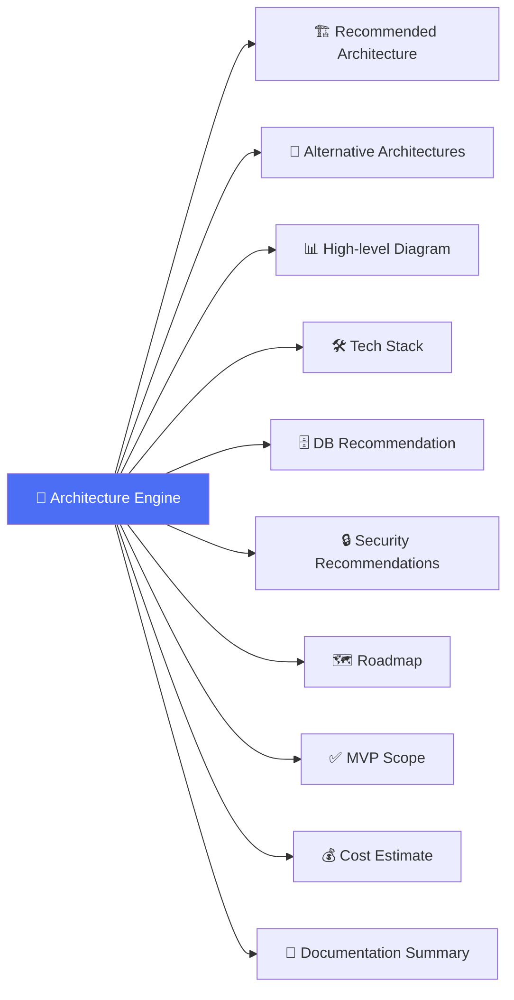

---

## 17. Core Outputs

### 17.1 Recommended Architecture

Platform sistemin genel mimarisini tanımlar:

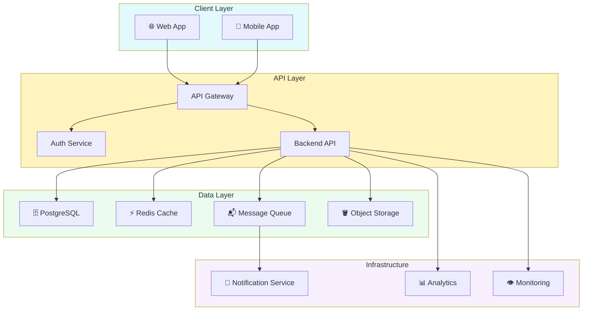

### 17.2 Alternative Architectures

En az **2–3 seçenek** sunulabilir:

| Yaklaşım | Avantajlar | Dezavantajlar | Maliyet | Complexity |
|----------|-----------|---------------|---------|------------|
| 🚀 **Hızlı MVP** | Hızlı TTM, düşük maliyet | Sınırlı ölçek | 💲 Düşük | ⭐ Az |
| ⚖️ **Balance** | İyi ölçek, makul maliyet | Orta complexity | 💲💲 Orta | ⭐⭐ Orta |
| 📈 **Scale-first** | Yüksek ölçek, hazır altyapı | Karmaşık, pahalı | 💲💲💲 Yüksek | ⭐⭐⭐ Yüksek |

### 17.3 Tech Stack Recommendation

| Katman | Öneri | Alternatif |
|--------|-------|-----------|
| **Frontend** | Next.js / React | Vue.js / SvelteKit |
| **Backend** | Node.js + NestJS | Spring Boot / FastAPI |
| **Mobile** | Flutter | React Native |
| **Database** | PostgreSQL | MongoDB / Firebase |
| **Cache** | Redis | Memcached |
| **Search** | Elasticsearch | Algolia |
| **Infrastructure** | AWS | GCP / Azure |

### 17.4 High-Level Architecture Diagram

Gösterebileceği bileşenler:

- Web / Mobile clients
- Frontend application
- API gateway
- Backend services
- DB, cache, storage
- External integrations
- Monitoring

### 17.5 Clickable Components *(Uzun Vadeli)*

Tıklanabilir bileşenler aşağıdaki bilgileri gösterecektir:

> - Bu bileşenin **rolü**
> - Neden **seçildiği**
> - **Alternatifleri**
> - Tahmini **maliyeti**
> - **Scaling** notları

### 17.6 Cost Estimation

$$\text{Toplam Maliyet} = C_{compute} + C_{database} + C_{storage} + C_{bandwidth} + C_{llm} + C_{third-party}$$

Sistem şu tür uyarılar da verebilmelidir:

> *"Firebase hızlıdır ama bu ölçekte **pahalı** olabilir."*
>
> *"Daha ucuz alternatif olarak PostgreSQL + Supabase benzeri yapı düşünülebilir."*

### 17.7 Security Recommendations

| Alan | Öneri |
|------|-------|
| **Auth** | JWT vs. session seçimi |
| **Yetkilendirme** | Role-based access control (RBAC) |
| **Veri** | Encryption at rest |
| **Secret Yönetimi** | Vault / environment-based secrets |
| **API** | Rate limiting |
| **Uyumluluk** | Audit logging |
| **Giriş** | Input validation & sanitization |

### 17.8 Roadmap

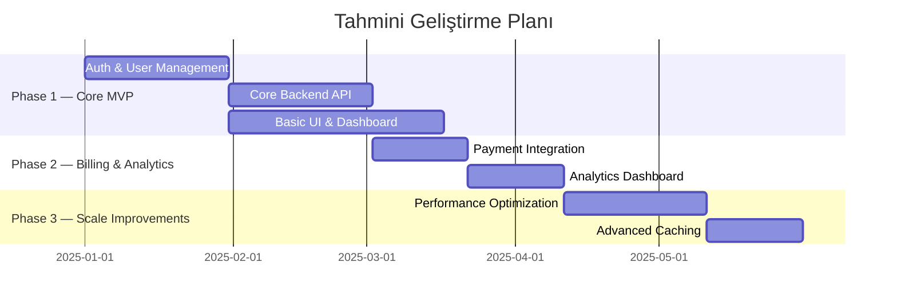

### 17.9 MVP Feature List

Hangi özelliklerin ilk versiyonda olması gerektiği açıkça belirtilir. *(Bkz. Bölüm 26)*

### 17.10 Documentation / Export

PDF çıktısı şu bölümleri içerir:

```
┌─────────────────────────────────┐
│  Project Documentation Pack     │
├─────────────────────────────────┤
│  • Problem summary              │
│  • Assumptions                  │
│  • Architecture overview        │
│  • Diagram                      │
│  • Tech stack                   │
│  • Roadmap                      │
│  • Risks                        │
│  • Cost summary                 │
└─────────────────────────────────┘
```

---

## 18. Interactive Editing Experience

Platformun önemli özelliklerinden biri, architecture çıktısının **statik olmamasıdır.**

### Örnek Revizyon Talepleri

```
💬 "Bunu daha ucuz yap."
💬 "AWS yerine GCP öner."
💬 "Firebase yerine PostgreSQL kullan."
💬 "Teknik bilgisi olmayan biri için daha basit anlat."
💬 "Microservice yerine monolith yaklaşımı dene."
💬 "Gerçek zamanlı chat ekle."
💬 "Security'yi artır ama maliyeti mümkün olduğunca düşük tut."
```

### Revizyon Kanalları

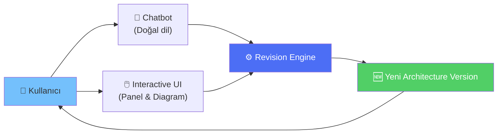

> Bu nedenle ürün, tek seferlik generator **değil**, iteratif bir $\textbf{architecture workspace}$ olacaktır.

---

## 19. AI System Design

Bu ürünün teknik merkezinde tek bir LLM değil, **çok katmanlı bir orchestration yapısı** bulunmalıdır.

### 19.1 Core AI Principle

$$\text{Güvenilirlik} = f(\text{LLM} + \text{Structured Rules} + \text{Pattern Library} + \text{External Data})$$

> LLM burada sadece metin üretmek için değil, **karar sürecine rehberlik etmek** için kullanılacaktır.

### 19.2 Main AI Subsystems

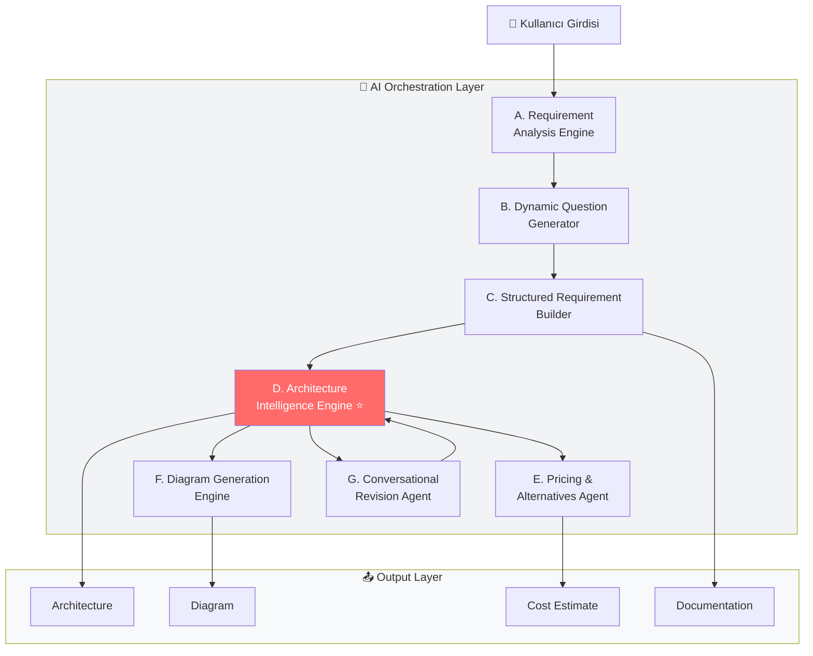

#### A. Requirement Analysis Engine

| Görev |
|-------|
| Kullanıcının doğal dil açıklamasını anlamak |
| Proje domain'ini belirlemek |
| Eksik bilgi alanlarını tespit etmek |
| Soru akışını başlatmak |

#### B. Dynamic Question Generator

| Görev |
|-------|
| Projeye göre akıllı sorular üretmek |
| Soru sayısını optimum tutmak |
| Gereksiz soruları elemek |
| Öncelikli karar alanlarını öne çıkarmak |

> **İlk sürümde önerilen yaklaşım:** Template-based question categories + LLM-assisted refinement *(hibrit model)*

#### C. Structured Requirement Builder

| Görev |
|-------|
| Cevapları normalize etmek |
| Eksik, çelişkili veya belirsiz alanları işaretlemek |
| Architecture engine'e uygun veri üretmek |

#### D. Architecture Intelligence Engine ⭐

> Bu ürünün **gerçek beynidir.**

| Görev |
|-------|
| Requirement verisini almak |
| Uygun pattern'leri eşleştirmek |
| 2–3 architecture alternatifi üretmek |
| Trade-off analizini yapmak |
| Recommended solution seçmek |

#### E. Pricing & Alternatives Agent

| Görev |
|-------|
| Cloud/service fiyatlarını hesaplamak |
| Firebase gibi tercihler için alternatifler önermek |
| Daha ucuz/ölçekli/hızlı seçenekleri karşılaştırmak |

#### F. Diagram Generation Engine

| Görev |
|-------|
| Architecture representation üretmek |
| Bileşenleri ve bağlantıları çizmek |
| Zamanla interactive diagram formatına dönüşmek |

#### G. Conversational Revision Agent

| Görev |
|-------|
| Üretilen sonucu canlı şekilde revize etmek |
| Kullanıcı sorularını cevaplamak |
| Yeni constraints ile architecture'ı yeniden şekillendirmek |

---

## 20. Architecture Decision Logic

Platformun güvenilir olabilmesi için karar mantığı **5 prensibe** dayanmalıdır:

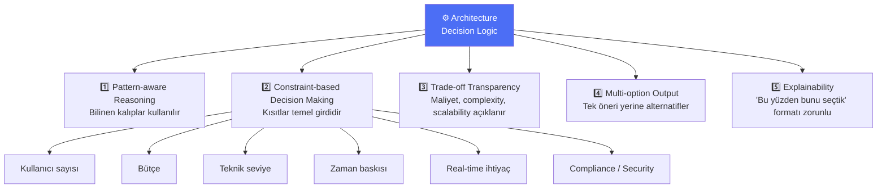

---

## 21. Suggested Internal Data Models

### 21.1 User Profile

```json
{
  "user_id": "usr_abc123",
  "role": "entrepreneur",
  "technical_level": "beginner",
  "preferred_detail_level": "simple",
  "language": "en"
}
```

### 21.2 Project Profile

```json
{
  "project_id": "prj_xyz789",
  "project_name": "CarRentX",
  "domain": "marketplace",
  "summary": "Car rental marketplace",
  "created_by": "usr_abc123",
  "created_at": "2025-01-15T10:00:00Z"
}
```

### 21.3 Requirements Model

```json
{
  "users_scale": "100k/month",
  "real_time": true,
  "payments": true,
  "mobile_required": true,
  "admin_panel": true,
  "budget": "medium",
  "preferred_provider": "AWS",
  "time_to_market": "fast"
}
```

### 21.4 Architecture Output Model

```json
{
  "recommended_option": "balanced_architecture",
  "alternatives": ["cheap_mvp", "scale_first"],
  "components": [],
  "tech_stack": {
    "frontend": "Next.js",
    "backend": "NestJS",
    "database": "PostgreSQL",
    "cache": "Redis",
    "infra": "AWS"
  },
  "diagram_ref": "diag_abc123",
  "cost_estimate": {
    "monthly_min": 150,
    "monthly_max": 400,
    "currency": "USD"
  },
  "roadmap": ["phase_1", "phase_2", "phase_3"]
}
```

---

## 22. System Architecture (Platform Itself)

### 22.1 High-Level Platform Modules

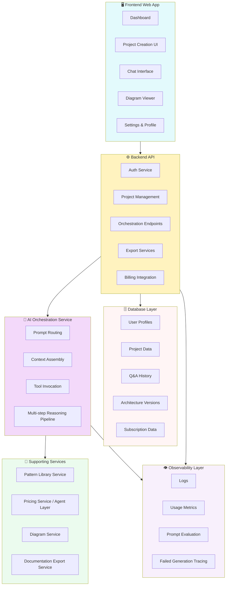

---

## 23. Suggested Technical Stack

*Bu bölüm, platformun **kendisini inşa etmek** için önerilen örnek stack'i içerir.*

### Frontend

| Teknoloji | Amaç |
|-----------|------|
| **Next.js** | React framework, SSR/SSG |
| **React** | UI component library |
| **TypeScript** | Type safety |
| **Tailwind CSS** | Utility-first styling |
| **shadcn/ui** | Component library |

### Backend

```
Node.js + NestJS
       veya
Node.js + Express / Fastify
```

### Database

| Teknoloji | Kullanım |
|-----------|---------|
| **PostgreSQL** | Core relational data |
| **Redis** | Cache / session / job state |

### Background Jobs

```
BullMQ / Queue System
```

### AI Integration

```
OpenAI / Anthropic / Multi-provider abstraction layer
```

### Diagram

| Teknoloji | Rol |
|-----------|-----|
| **Mermaid** | Intermediate diagram model |
| **React Flow** | Interactive visualization layer |
| **SVG pipeline** | Export |

### Auth

```
Clerk  /  Auth.js  /  Custom JWT Solution
```

### Storage & Infrastructure

| Bileşen | Teknoloji |
|---------|-----------|
| **Object Storage** | S3-compatible |
| **Billing** | Stripe |
| **Infra** | AWS (başlangıç) |
| **Deployment** | Docker / Containerized |

---

## 24. Pricing Intelligence Layer

### 24.1 Why This Matters

Teknik kullanıcı olmayan biri çoğu zaman şu hataları yapar:

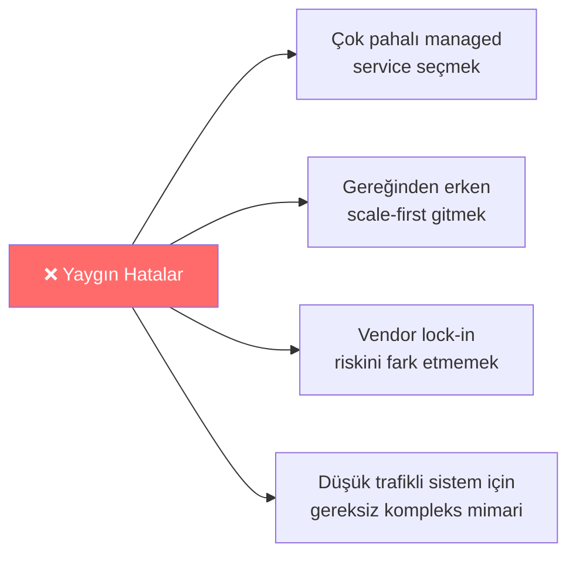

### 24.2 Pricing Capabilities

$$\text{Aylık Altyapı Maliyeti} \approx C_{compute} + C_{DB} + C_{storage} + C_{bandwidth} + C_{LLM} + C_{baseline}$$

Sistem şu hesaplamaları yapabilmelidir:

| Kategori | Hesaplama Türü |
|----------|---------------|
| **Compute** | Instance type + saatlik kullanım |
| **Database** | Managed DB maliyeti vs. self-hosted |
| **Storage** | GB/month + transfer |
| **Bandwidth** | Egress maliyeti |
| **LLM Usage** | Token tahmin modeli |
| **Third-party** | Stripe, SendGrid, vb. |

### 24.3 Alternative Suggestion Examples

| Pahalı Seçenek | Öneri | Tasarruf |
|---------------|-------|---------|
| Firebase (yüksek trafik) | PostgreSQL + Supabase | ~%40-60 |
| AWS fully managed stack | Lean microservices | ~%30-50 |
| Microservices (erken aşama) | Monolith first | Dev time + cost |

### 24.4 Technical Challenge Note

> ⚠️ **Pricing + LLM orkestrasyonunun senkron ve güvenilir şekilde çalışması**, ürünün en kritik teknik zorluklarından biridir.

---

## 25. Business Model

### 25.1 Primary Model

$$\boxed{\textbf{Freemium} + \textbf{Monthly Subscription}}$$

### 25.2 Plan Karşılaştırması

| Özellik | 🆓 Free | 💎 Pro | 👥 Team *(gelecek)* |
|---------|---------|--------|---------------------|
| Proje sayısı | 1 | Sınırsız | Sınırsız |
| Architecture overview | ✅ | ✅ | ✅ |
| Basic diagram | ✅ | ✅ | ✅ |
| Basic tech stack | ✅ | ✅ | ✅ |
| Chatbot (mesaj limiti) | Sınırlı | Sınırsız | Sınırsız |
| PDF export | ❌ | ✅ | ✅ |
| Advanced revisions | ❌ | ✅ | ✅ |
| Cost optimization | ❌ | ✅ | ✅ |
| Deep documentation | ❌ | ✅ | ✅ |
| Alternative comparisons | ❌ | ✅ | ✅ |
| Collaboration | ❌ | ❌ | ✅ |

### 25.3 Free Plan Philosophy

> Amaç, kullanıcıya platformun gerçek değerini **göstermektir.** Free plan tamamen anlamsız kısıtlanmamalıdır.

### 25.4 Future Plans

```
Free → Pro → Team → Agency → Enterprise
```

---

## 26. MVP Definition

### 26.1 MVP Goal

$$\text{Hedef: } \leq 4\text{-}5 \text{ ay içinde çalışır, gerçek değer üreten web application}$$

### 26.2 MVP Must-Haves ✅

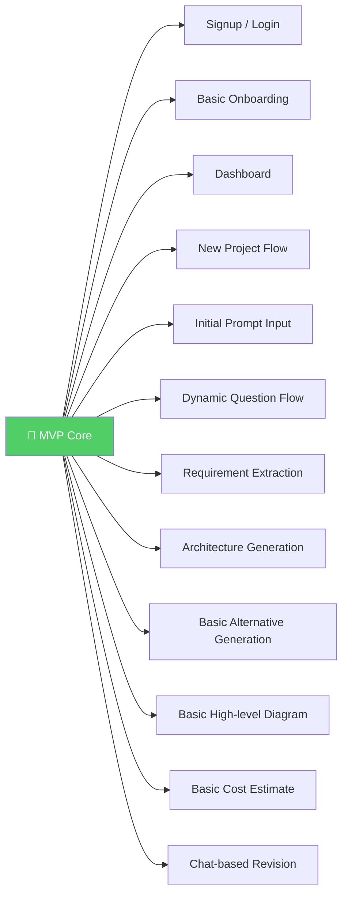

### 26.3 MVP Should-NOT-Haves ❌

| Özellik | Neden Erteleniyor |
|---------|-----------------|
| Tam gelişmiş interactive diagram editor | Yüksek teknik yük |
| Multi-user collaboration | MVP dışı kapsam |
| Full version history | Önce core value |
| Enterprise permission system | B2B gelecek planı |
| Multi-cloud deep price engine | Yüksek veri güncelleme yükü |
| Çok geniş domain coverage | Odak kaybı riski |
| Detaylı PDF publishing | Export iterasyonu |

### 26.4 MVP Success Definition

$$\text{MVP Başarılı} \Leftrightarrow \text{Kullanıcı şunları yapabilir:}$$

> ✅ Fikrini anlatabilir
> ✅ Doğru sorulara cevap verebilir
> ✅ Anlamlı bir architecture çıktısı alabilir
> ✅ Bu çıktı üzerinde revizyon yapabilir
> ✅ Platformun gerçek değerini hissedebilir

---

## 27. Development Constraints

> ⚠️ Bu ürün başlangıçta **2 adet 3. sınıf yazılım mühendisliği öğrencisi** tarafından geliştirilecektir.

Bu gerçek, her karara yansımalıdır:

| Kısıt | İmplication |
|-------|-------------|
| Küçük ekip | Kapsam kontrollü olmalı |
| Sınırlı deneyim | Reusable pattern library yaklaşımı |
| Zaman baskısı | En zor UI problemleri ertelenmeli |
| Öncelik | Çekirdek decision engine önce kanıtlanmalı |
| Görsel | Önemli, ama mantık çekirdeği öncelikli |

---

## 28. Main Technical Risks

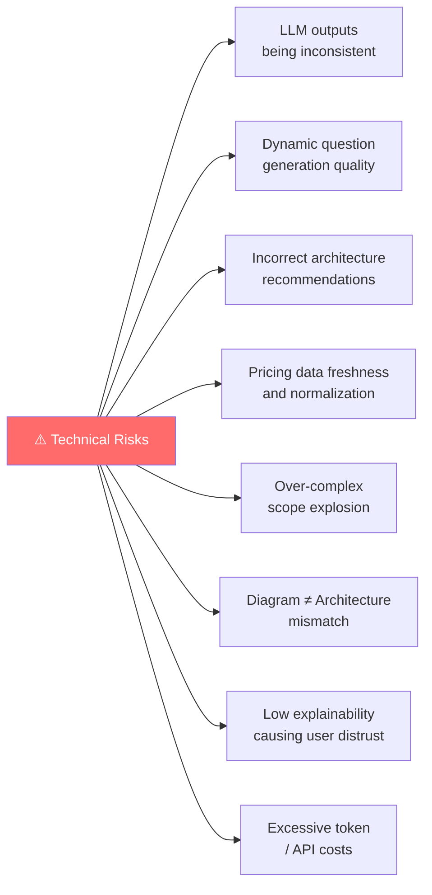

---

## 29. Risk Mitigation Strategies

### Risk: LLM Hallucination

| Çözüm |
|-------|
| ✅ Pattern library kullanımı |
| ✅ Structured output schemas |
| ✅ Validation layers |
| ✅ Deterministic post-processing |

### Risk: Scope Explosion

| Çözüm |
|-------|
| ✅ Pattern-first development |
| ✅ Strict MVP boundaries |
| ✅ v2/v3 backlog separation |

### Risk: Poor Pricing Estimates

| Çözüm |
|-------|
| ✅ Approximation labels ("tahmini") |
| ✅ Region-specific assumptions |
| ✅ Transparent estimation disclaimers |
| ✅ Service catalog normalization |

### Risk: User Distrust

| Çözüm |
|-------|
| ✅ Explanations ("Bu yüzden seçtik") |
| ✅ Alternatives (her zaman birden fazla seçenek) |
| ✅ Trade-off tables |
| ✅ Reasoned recommendations |

---

## 30. Non-Functional Requirements

### Performance

$$\text{Generation süresi} \leq \text{Kullanıcıyı kaybettirecek eşik}$$

- Soru akışları hızlı olmalı
- Generation süresi kullanıcı deneyimini bozmamalı

### Reliability

```
Generation işlemleri → retry edilebilmeli
Failed job state     → yönetilmeli
```

### Security

| Gereksinim | Detay |
|-----------|-------|
| **Veri gizliliği** | Kullanıcı proje verileri korunmalı |
| **Erişim kontrolü** | Access control uygulanmalı |
| **API güvenliği** | API key management dikkatle yapılmalı |

### Scalability

- Architecture generation **async** işlenebilir
- Job queue yaklaşımı tercih edilebilir

### Maintainability

- Pattern library **modüler** olmalı
- Provider abstraction katmanları ayrılmalı

---

## 31. UX Principles

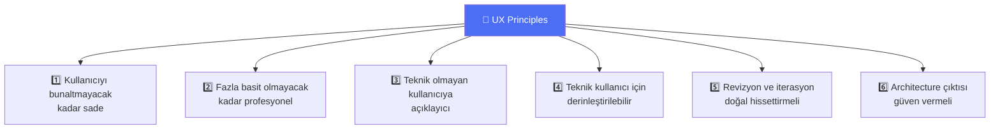

---

## 32. Example User Journey

**Journey: Non-technical Founder**

```mermaid
journey
    title Non-Technical Founder — Platform Yolculuğu
    section Kayıt
      Signup olur: 5: Kullanıcı
      Teknik seviyeyi seçer (Düşük): 5: Kullanıcı
    section Proje Oluşturma
      Dashboard'ta New Project tıklar: 5: Kullanıcı
      Fikri yazar: 4: Kullanıcı
      12 soruyu cevaplar: 3: Kullanıcı, Platform
    section Architecture Alma
      3 alternatif üretilir: 5: Platform
      Recommended seçilir: 5: Platform
      High-level diagram gösterilir: 5: Platform
    section Revizyon
      Bu biraz pahalı, daha ucuz yap: 4: Kullanıcı
      Alternatif önerilir: 5: Platform
    section Export
      Proje dokümanını export eder: 5: Kullanıcı
```

---

## 33. Example Revision Prompts

Kullanıcıların platforma yöneltebileceği örnek revizyon talepleri:

```bash
# Maliyet optimizasyonu
"Can you reduce the monthly cost?"

# Tech stack değişikliği
"Use PostgreSQL instead of Firebase."

# Yeni özellik ekleme
"I need real-time notifications too."

# Sadelik talebi
"I want this explained at a non-technical level."

# Mimari yaklaşım değişikliği
"Show me a scale-first architecture."

# Senaryo değişikliği
"What if I expect 1 million users instead of 100k?"
```

---

## 34. Success Metrics

### 📊 Product Metrics

| Metrik | Ölçüm |
|--------|-------|
| Project creation completion rate | % tamamlama |
| Question flow completion rate | % tamamlama |
| Architecture generation success rate | Başarılı / toplam |
| Revision engagement rate | Revizyon / proje |
| PDF/export usage | Export / proje |
| Upgrade conversion rate | Free → Pro % |

### 👤 User Value Metrics

| Metrik | Ölçüm Yöntemi |
|--------|---------------|
| User perceived usefulness score | Anket / NPS |
| Clarity of recommendations | In-app rating |
| Trust in architecture output | Qualitative research |
| Time saved vs. manual research | User interview |

### 💰 Business Metrics

| Metrik | Hedef |
|--------|-------|
| Free to paid conversion | > %5 |
| Monthly Recurring Revenue (MRR) | Büyüme trendi |
| Churn rate | < %5/ay |
| Cost per generated project | Azalma trendi |

---

## 35. Roadmap Suggestion

```mermaid
timeline
    title AI Software Architect Platform — Product Roadmap

    section Phase 0
        Validation : Product framing
                   : Landing page
                   : User interviews
                   : Architecture pattern definition

    section Phase 1
        MVP Core : Onboarding
                 : Project creation
                 : Requirement capture
                 : Architecture generation
                 : Basic diagram
                 : Basic pricing

    section Phase 2
        Improvement Layer : Stronger revision flows
                          : Better explanations
                          : More accurate cost analysis
                          : Export improvements

    section Phase 3
        Interactive Workspace : Clickable components
                              : Richer diagram interactions
                              : Versioning
                              : Compare architectures side by side

    section Phase 4
        Commercial Expansion : Team plans
                             : Collaboration
                             : Organization workspaces
                             : Enterprise controls
```

---

## 36. Long-Term Expansion Ideas

| Fikir | Açıklama |
|-------|----------|
| 🌐 More architecture domains | IoT, fintech, social, analytics |
| 🏢 Enterprise system design | B2B, complex org structures |
| 💻 Code scaffold suggestions | Starter code generation |
| 🏗️ Infra-as-code output | Terraform / Pulumi starter |
| 📋 Jira / Linear integration | Task backlog generation |
| 📊 Pitch deck technical appendix | Founder-ready tech slides |
| 📦 Dev handoff package | Handing off to developers |
| 🔍 Architecture review mode | Mevcut projeyi analiz et |
| 🤝 AI pair architect mode | Gerçek zamanlı co-design |

---

## 37. What This Product Is Not

$$\text{Bu ürün} \neq \text{Kod yazan tam otomatik no-code builder}$$
$$\text{Bu ürün} \neq \text{Sadece çizim yapan diagram aracı}$$
$$\text{Bu ürün} \neq \text{Sadece ChatGPT wrapper}$$
$$\text{Bu ürün} \neq \text{Kusursuz ve nihai karar verici}$$
$$\text{Bu ürün} \neq \text{İnsan architect'lerin tam yerini alan sistem}$$

### Bunun Yerine:

$$\boxed{\text{Güçlü, açıklanabilir, iteratif ve ürünleşmiş bir } \textit{software architecture decision platformu}}$$

---

## 38. Strategic Insight

Bu ürünün gerçek değeri, yalnızca LLM çağırmakta **değildir.**

$$\text{Gerçek Değer} = \underbrace{\text{Doğru requirement extraction}}_{\text{foundation}} + \underbrace{\text{Pattern-aware reasoning}}_{\text{intelligence}} + \underbrace{\text{Architecture alternatives}}_{\text{options}} + \underbrace{\text{Cost awareness}}_{\text{reality check}} + \underbrace{\text{Visual output}}_{\text{clarity}} + \underbrace{\text{Iterative guidance}}_{\text{trust}}$$

> *Bu ürünün kalbi **model değil**, **karar sistemidir.***

---

## 39. Final Product Definition

$$\boxed{
\begin{aligned}
&\textbf{AI Software Architect Platform;} \\
&\text{kullanıcıyı yapılandırılmış bir keşif sürecinden geçirerek} \\
&\text{yazılım gereksinimlerini analiz eden,} \\
&\text{alternatif sistem mimarileri üreten,} \\
&\text{maliyet ve teknoloji trade-off'larını açıklayan,} \\
&\text{interaktif diyagram ve dokümantasyon çıktıları sağlayan,} \\
&\textbf{web tabanlı bir architecture workspace ürünüdür.}
\end{aligned}
}$$

---

## 40. Immediate Next Deliverables

Bu dokümandan sonra hazırlanabilecek en mantıklı belgeler:

| # | Doküman | Öncelik |
|---|---------|---------|
| 1 | **Product Requirements Document (PRD)** | 🔴 Yüksek |
| 2 | **MVP scope breakdown** | 🔴 Yüksek |
| 3 | **Technical architecture of the platform** | 🔴 Yüksek |
| 4 | **Database schema draft** | 🟠 Orta |
| 5 | **AI orchestration flow spec** | 🟠 Orta |
| 6 | **UI page map / screen map** | 🟠 Orta |
| 7 | **User stories & acceptance criteria** | 🟡 Normal |
| 8 | **Monetization / pricing sheet** | 🟡 Normal |
| 9 | **Investor / pitch summary** | 🟡 Normal |
| 10 | **Task backlog for development** | 🟡 Normal |

---

## 41. Short Conclusion

Bu platform, doğru şekilde scope edilirse büyük bir startup fikrine dönüşebilir. Ancak başarı; *"her şeyi yapmak"* hedefinden değil, **çekirdek değeri doğru kanıtlamaktan** gelecektir.

İlk odak, şu soruyu güçlü biçimde cevaplayan bir ürün çıkarmak olmalıdır:

$$\boxed{\textit{"Kullanıcı bir yazılım fikrine başlamadan önce, gerçekten bu platforma danışma ihtiyacı hissediyor mu?"}}$$

Eğer cevap **evet** olursa, bu ürün sadece bir araç değil, yazılım geliştirme sürecinin standart başlangıç noktalarından biri haline gelebilir.

---

## One-Sentence Summary

$$\textit{"This platform is a web-based AI Software Architect that guides users before they start building software,}$$
$$\textit{asks the right questions, recommends the right architecture, compares trade-offs,}$$
$$\textit{estimates costs, and turns architectural thinking into actionable visual documentation."}$$

---

*— AI Software Architect Platform Documentation v1.0 —*
